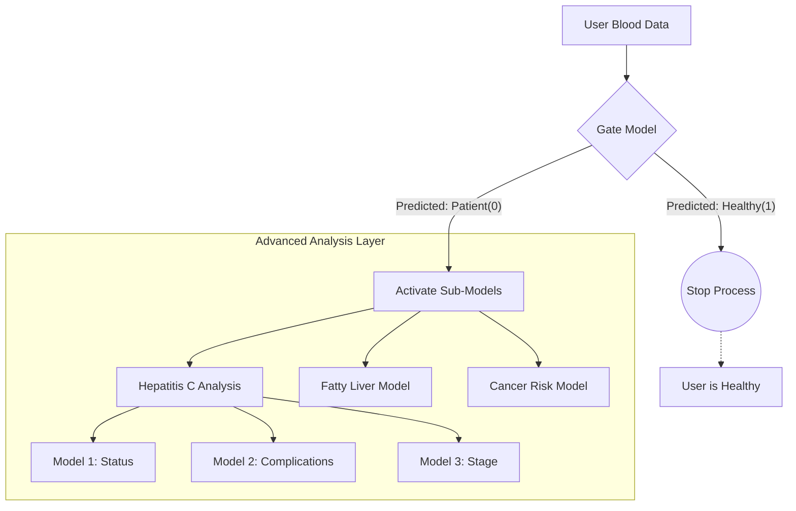

# The Gate Model: First Line of Defense

This section is dedicated to the initial triage of users, functioning as the system's "First Line of Defense." It employs a binary classification approach to distinguish between healthy individuals and potential liver patients. The system relies on an **XGBoost** training model, with its core file built as `models/gate_model.pkl`. The model analyzes biochemical input values based on "weights" acquired during the training phase on a rigorously cleaned dataset, ensuring resource efficiency by filtering out healthy users before activating complex sub-models.

---

### Dataset Overview

| Name | Database Location | Function |
| --- | --- | --- |
| **gate_model.pkl** | `models/` | The trained model containing the final decision-making weights(Sick, Healthy). |
| **train_gate_model.py** | `code/` | Source code responsible for cleaning data and training the model. |
| **test_gate_model.py** | `code/` | Source code dedicated to testing the efficiency of the trained model. |
| **Liver_Patient_Dataset_Cleaned_19k.csv** | `data/processed` | The cleaned training dataset containing ~19,000 unique records. |
| **XGBoost.md** | `docs/` | Technical documentation explaining the mechanism of the XGBoost algorithm. |

---
### Training Phase

The system's efficiency depends on a data split of **80% for training** and **20% for testing**, which resulted in a realistic real-world accuracy of **97%**.

* **Data Processing:** Unlike standard datasets, **rigorous preprocessing** was performed. Over 11,000 duplicate rows were identified and removed from the original raw file (`data/raw/Liver Pationt Dataset (LPD)_train.csv`).
* **Training Data:** The model was trained on data from approximately **15,500 patients** extracted from the `Liver_Patient_Dataset_Cleaned_19k.csv` file.
* **Testing Data:** Data from approximately **3,800 patients** was reserved to test the accuracy and validity of the model on unseen data.

> This split adheres to the "Golden Standard" for building a robust "Smart System." Crucially, this model was trained on a **de-duplicated dataset** (reduced from 30k to 19k rows) to prevent "Data Leakage" and ensure the model learns actual patterns rather than memorizing repeated entries (for more info about ML: `docs/XGBoost.md`).

---

### 1- Data Source and Integrity

* **Original Database:** Retrieved from the "Liver Disease Patient Dataset" on **Kaggle**, curated by **Abhishek Shrivastav** (2018).
* **Data Link:** [Source on Kaggle](https://www.kaggle.com/datasets/abhi8923shriv/liver-disease-patient-dataset)
* **Data Transformation:** The raw training file (`data/raw/Liver Pationt Dataset (LPD)_train.csv`) was processed and transformed into the final optimized dataset (`data/processed/Liver_Patient_Dataset_Cleaned_19k.csv`) used to train this model.

---

### 2- Model Input Requirements

To ensure result accuracy, data must be entered in the strict mathematical order used during model training:
`['Age', 'Gender', 'Total_Bilirubin', 'Direct_Bilirubin', 'Alkaline_Phosphotase', 'Alamine_Aminotransferase', 'Aspartate_Aminotransferase', 'Total_Protiens', 'Albumin', 'Albumin_and_Globulin_Ratio']`

---

## Gateway Architecture 

The system is designed with a **resource-efficient workflow**. Instead of running all diagnostic models (HepatitisC 3-models and Fatty Liver, Cancer) simultaneously—which consumes processing power espetially if were added more models in future*—the Gate Model acts as a smart filter.

### How it Works:
1.  **Screening:** The user's data is first processed *only* by the Gate Model.
2.  **Decision Making:**
    * **If Healthy(1):** The workflow terminates immediately. No further analysis is needed. This ensures **zero unnecessary computation**.
    * **If Patient(0):** The system recognizes a risk and *only then* activates the secondary specialized models to diagnose the specific condition.

> This "Conditional Computation" approach ensures that the application remains lightweight and fast, saving device battery and server resources by preventing the execution of complex models on healthy users.

---

## Logic Flowchart

---

# Gate Model Testing & Validation

To ensure the reliability of the **Gate Model** as the primary screening layer, it was subjected to a rigorous "Stress Test" using 10 synthetic medical cases designed to mimic real-world scenarios. These cases range from clearly healthy individuals to critical patients, including complex "borderline" cases to test the model's sensitivity.

## 1. Test Data Overview
The testing dataset consists of **10 distinct profiles** with varying biochemical markers.
* test_gate_model.py inside `code/`, ore 

### Cases Medical Analysis of The 10 Cases

| Case ID | Condition | Key Medical Indicators (Why?) |
| :---: | :--- | :--- |
| **1** |  **Sick** | **High Bilirubin (8.5)** & Elevated Enzymes (SGPT 200). Classic Jaundice signs. |
| **2** |  **Sick** | **Very Low Albumin (1.8)** & Inverted A/G Ratio (0.50). Indicates chronic liver dysfunction. |
| **3** |  **Sick** | **Extreme Bilirubin (15.0)** & High Alkphos (550). Signs of acute hepatitis |
| **4** |  **Sick** | **SGOT > SGPT** (250 vs 80). A classic pattern often associated with Alcoholic Liver Disease. |
| **5** | **Sick** | Moderate enzyme elevation (SGPT 150) & **Fatty Liver** indicators. |
| **6** |  **Sick** | **Elderly Patient (75)** with critical enzyme levels and low proteins. |
| **7** |  **Healthy** | All values are within the standard reference ranges for a young adult. |
| **8** |  **Borderline** | **Slightly elevated Alkaline Phosphotase (180).** Medically ambiguous, but the model flags it as "Risk". |
| **9** |  **Borderline** | **Senior (65)** with Alkphos (195). Age-related or pathologic? The model chooses safety (Sick). |
| **10** | **Healthy** | Perfect blood work. Young individual (18) with optimal liver function. |

---

## 2. Model Predictions & Output Analysis

The following table shows the actual raw output from the model (`0=Sick` or `1=Healthy`) and the interpretation.

| Case | Raw Output | Diagnosis | Medical Expectation | Result Status |
| :---: | :---: | :--- | :--- | :--- |
| **1** | `0` | Liver Patient | **Sick** |  **PASS** |
| **2** | `0` | Liver Patient | **Sick** |  **PASS** |
| **3** | `0` | Liver Patient | **Sick** |  **PASS** |
| **4** | `0` | Liver Patient | **Sick** |  **PASS** |
| **5** | `0` | Liver Patient | **Sick** |  **PASS** |
| **6** | `0` | Liver Patient | **Sick** |  **PASS** |
| **7** | `1` | Healthy | **Healthy** |  **PASS** |
| **8** | `0` | Liver Patient | *Borderline / High Normal* |**Safety Trigger** |
| **9** | `0` | Liver Patient | *Borderline / Elderly* | **Safety Trigger** |
| **10** | `1` | Healthy | **Healthy** |**PASS** |

* PASS: This label indicates that the model output is consistent with the internal design logic of the Gate Model. Clearly normal"Healthy" and clearly abnormal"Sick" cases were classified directly.

* Safety Trigger : For borderline cases (Cases 8 & 9), instead of treating near-threshold values as normal, the model intentionally applies a conservative bias and classifies them as Sick to avoid early exclusion from the analytical pipeline.

> The Gate Model is main objective is to minimize false negatives by forwarding ambiguous cases to more advanced analysis layers, even if this results in a higher number of false positives at the initial stage.

---

## 3. Discussion: Why did the model fail/warn on Cases 8 & 9?

In medical diagnostics, **Sensitivity (Recall)** is often prioritized over Precision.
* **Cases 8 & 9** represent "Borderline" patients. Their enzyme levels (specifically Alkaline Phosphotase) are slightly above the typical upper limit (~140-150).
* **Model Logic:** The Gate Model is designed to be **Conservative**. It prefers to flag a slightly abnormal case as "Sick" (False Positive) rather than telling a sick person they are healthy (False Negative).
* **Outcome:** By classifying these borderline cases as `0` (Sick), the system successfully passes them to the **Specialized Sub-Models** (Fatty Liver/Hepatitis) for a deeper, more accurate check. **This is a feature, not a bug.**

### B- Analysis of Positive Detection (Cases 1-6)
The model demonstrated **100% Sensitivity** in detecting clearly pathological cases. The Gate Model successfully identified various patterns of liver dysfunction:

* **Critical Enzyme Elevation:** In **Case 1 & 3**, the model picked up on extreme levels of Bilirubin (Hyperbilirubinemia) and SGPT, which are strong indicators of acute liver injury or obstruction.
* **Chronic Indicators:** In **Case 2**, despite some enzymes being moderate, the model correctly flagged the patient based on **Hypoalbuminemia** (Low Albumin: 1.8) and an inverted A/G Ratio, signaling chronic liver failure or cirrhosis.
* **Specific Patterns:** **Case 4** was correctly identified. This case simulated an **Alcoholic Liver Disease** pattern where SGOT (AST) is significantly higher than SGPT (ALT) (Ratio > 2:1), a nuance the model learned effectively.
* **Elderly Risk:** **Case 6** shows that the model correctly weights age as a risk factor when combined with deteriorating protein levels.

> **Conclusion:** The model does not rely on a single feature but analyzes the *correlation* between enzymes, proteins, and age to determine risk.

### D- Analysis of Negative/Healthy Cases (7 & 10)
Just as important as detecting disease is the ability to recognize health (Specificity).

* **Reference Ranges:** For **Cases 7 & 10**, all biochemical markers (Bilirubin < 1.0, SGPT < 40, Albumin > 3.5) fell strictly within standard medical reference ranges.
* **Resource Saving:** By correctly classifying these users as `1` (Healthy), the Gate Model effectively **stopped the workflow**.
* **Impact:** This validates the "Efficiency First" architecture. No computational power was wasted running the Hepatitis or Cancer models for these clearly healthy individuals.
